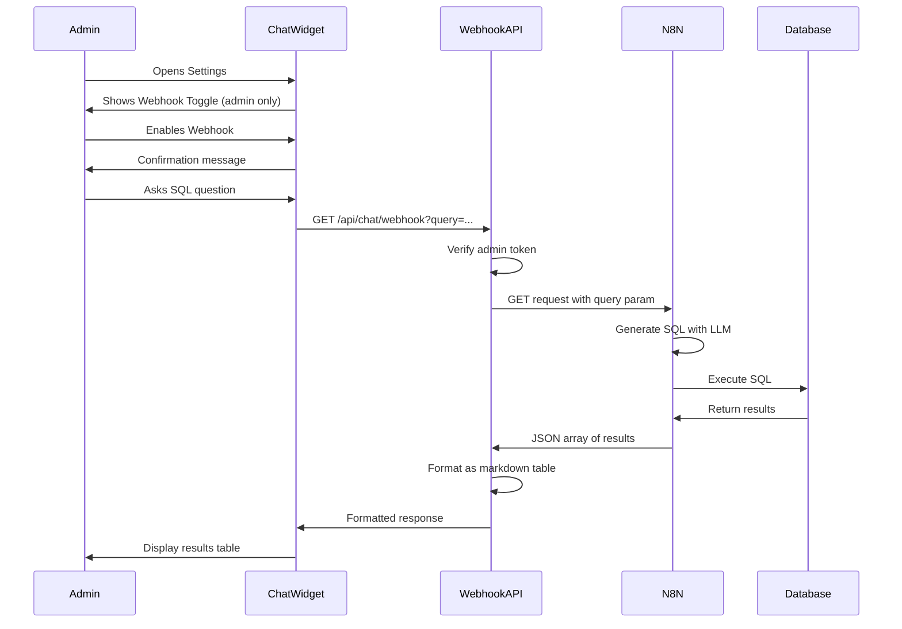

# Admin Webhook Toggle - Implementation Walkthrough

## Overview

Successfully implemented an admin-only webhook toggle feature in the EduLearn chatbot that allows routing chat requests to an n8n webhook for SQL query execution instead of Gemini AI.

## What Was Implemented

### 1. Backend API Route

#### [webhook/route.ts](file:///home/harsha/Documents/GitHub/EduLearn/app/api/chat/webhook/route.ts)

Created a new API endpoint `/api/chat/webhook` that:
- ✅ Verifies admin authentication using JWT
- ✅ Accepts question from admin users
- ✅ Sends GET request to n8n webhook with query parameter
- ✅ Formats SQL query results as markdown tables
- ✅ Handles timeouts and errors gracefully

**Key Features:**
- Admin-only access (403 Forbidden for non-admins)
- 30-second timeout with proper error handling
- Automatic table formatting for array results
- Displays up to 50 rows with pagination indicator

### 2. Frontend Integration

#### [chatbot-widget.tsx](file:///home/harsha/Documents/GitHub/EduLearn/components/chatbot/chatbot-widget.tsx)

**Added State Management:**
```typescript
const [useWebhook, setUseWebhook] = useState(false);
```

**LocalStorage Persistence:**
- Webhook preference saved to `edulearn_admin_webhook_enabled`
- Automatically restored on page reload for admin users

**Settings Panel UI:**
- Toggle switch visible only to admin users
- Clear labeling: "SQL Webhook Mode"
- Confirmation message when toggled

**Message Routing Logic:**
```typescript
if (user.role === 'admin' && useWebhook) {
  // Route to webhook
  await fetch('/api/chat/webhook', { ... });
} else {
  // Route to Gemini AI (existing flow)
  await fetch('/api/chat', { ... });
}
```

### 3. Configuration

#### [.env](file:///home/harsha/Documents/GitHub/EduLearn/.env)

Added webhook configuration:
```bash
N8N_WEBHOOK_URL=https://harsha23eg105e29.app.n8n.cloud/webhook-test/edulearn
N8N_WEBHOOK_TIMEOUT=30000
```

### 4. Type Definitions

#### [webhook-types.ts](file:///home/harsha/Documents/GitHub/EduLearn/lib/types/webhook-types.ts)

Created TypeScript interfaces for type safety:
- `WebhookRequest` - Request payload structure
- `WebhookResponse` - Response format
- `WebhookConfig` - Configuration options

---

## How It Works

### User Flow



### Request Format

**Webhook GET Request:**
```
GET https://harsha23eg105e29.app.n8n.cloud/webhook-test/edulearn?query=list%20all%20students
```

**Expected Response:**
```json
[
  {
    "first_name": "Alice",
    "last_name": "Williamson"
  },
  {
    "first_name": "Ryan",
    "last_name": "Miller"
  }
]
```

**Formatted Display:**
```markdown
**Query Results** (2 rows):

| first_name | last_name |
| --- | --- |
| Alice | Williamson |
| Ryan | Miller |
```

---

## Security Features

> [!IMPORTANT]
> **Admin-Only Access**
> - Toggle switch only visible to users with `role: 'admin'`
> - API endpoint validates JWT and checks admin role
> - Returns 403 Forbidden for non-admin attempts

> [!WARNING]
> **SQL Injection Protection**
> - Ensure n8n webhook has proper SQL validation
> - Consider implementing query whitelisting
> - Monitor webhook logs for suspicious queries

---

## Testing Instructions

### 1. Admin User Testing

1. **Login as Admin**
   - Navigate to http://localhost:3000
   - Login with admin credentials

2. **Enable Webhook Mode**
   - Open chatbot (bottom right)
   - Click Settings icon (gear)
   - Toggle "SQL Webhook Mode" ON
   - Verify confirmation message appears

3. **Test SQL Query**
   - Type: "list all student names"
   - Send message
   - Verify results display as formatted table
   - Check that results match database

4. **Disable Webhook Mode**
   - Toggle "SQL Webhook Mode" OFF
   - Send another message
   - Verify it goes to Gemini AI (conversational response)

### 2. Non-Admin User Testing

1. **Login as Teacher/Student**
   - Login with non-admin account

2. **Verify Toggle Hidden**
   - Open chatbot
   - Click Settings (if visible)
   - Verify webhook toggle is NOT shown

3. **Verify Normal Operation**
   - Send messages
   - Verify they route to Gemini AI normally

### 3. Error Handling Testing

**Test Timeout:**
```
- Enable webhook mode
- Send complex query that takes >30 seconds
- Verify timeout error message appears
```

**Test Invalid Query:**
```
- Send malformed SQL question
- Verify error is handled gracefully
```

**Test Network Failure:**
```
- Disable internet connection
- Send message
- Verify network error message
```

---

## Files Modified

### Created Files
- [app/api/chat/webhook/route.ts](file:///home/harsha/Documents/GitHub/EduLearn/app/api/chat/webhook/route.ts) - Webhook proxy API
- [lib/types/webhook-types.ts](file:///home/harsha/Documents/GitHub/EduLearn/lib/types/webhook-types.ts) - Type definitions

### Modified Files
- [components/chatbot/chatbot-widget.tsx](file:///home/harsha/Documents/GitHub/EduLearn/components/chatbot/chatbot-widget.tsx) - Added toggle UI and routing logic
- [.env](file:///home/harsha/Documents/GitHub/EduLearn/.env) - Added webhook configuration

---

## Configuration Reference

### Environment Variables

| Variable | Value | Description |
| --- | --- | --- |
| `N8N_WEBHOOK_URL` | `https://harsha23eg105e29.app.n8n.cloud/webhook-test/edulearn` | n8n webhook endpoint |
| `N8N_WEBHOOK_TIMEOUT` | `30000` | Request timeout in milliseconds |

### LocalStorage Keys

| Key | Value | Description |
| --- | --- | --- |
| `edulearn_admin_webhook_enabled` | `"true"` or `"false"` | Admin webhook preference |

---

## Next Steps

### Recommended Enhancements

1. **Query History**
   - Log all webhook queries for audit trail
   - Display query history to admin

2. **Query Validation**
   - Implement query whitelisting
   - Add approval flow for destructive queries

3. **Performance Monitoring**
   - Track webhook response times
   - Alert on slow queries

4. **Enhanced Formatting**
   - Support for charts/graphs
   - Export results to CSV/Excel

5. **Multi-Database Support**
   - Allow admin to select target database
   - Support different connection profiles

---

## Troubleshooting

### Webhook Toggle Not Visible
- **Cause:** User is not admin
- **Solution:** Verify user role in database is `'admin'`

### Webhook Request Fails
- **Cause:** Invalid webhook URL or network issue
- **Solution:** Check `.env` file and test webhook URL in Postman

### Results Not Formatted
- **Cause:** Webhook returns non-array response
- **Solution:** Verify n8n workflow returns JSON array

### Timeout Errors
- **Cause:** Query takes too long
- **Solution:** Optimize SQL query or increase timeout in `.env`

---

## Summary

✅ **Completed:**
- Admin-only webhook toggle in chatbot settings
- GET request to n8n webhook with query parameter
- Automatic markdown table formatting for results
- Error handling and timeout management
- LocalStorage persistence of preference
- Security validation (admin-only access)

🎯 **Ready for Testing:**
- Login as admin and test webhook mode
- Verify non-admin users cannot access feature
- Test various SQL queries and error scenarios
